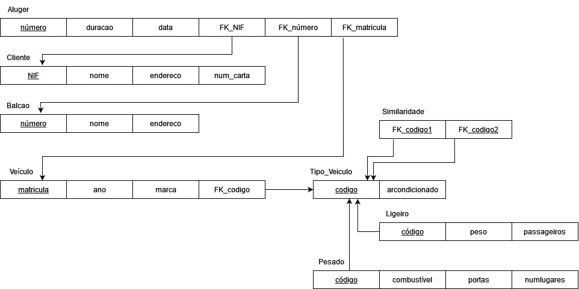
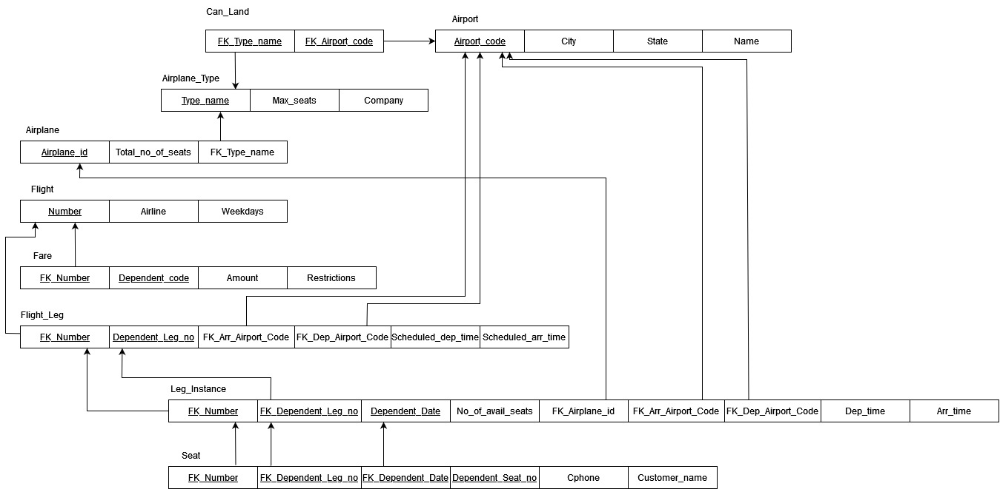
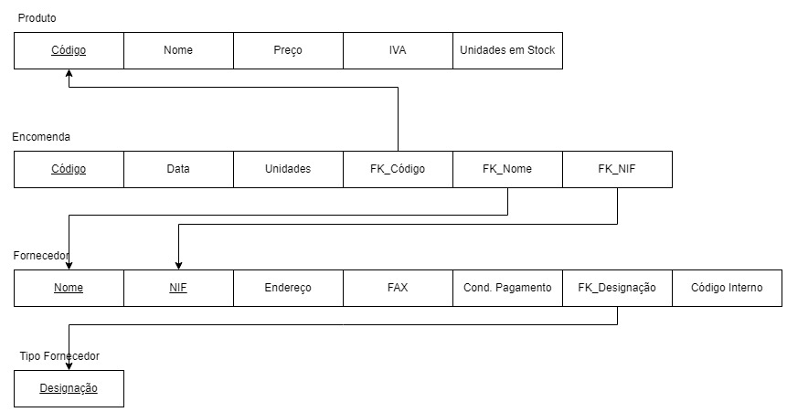
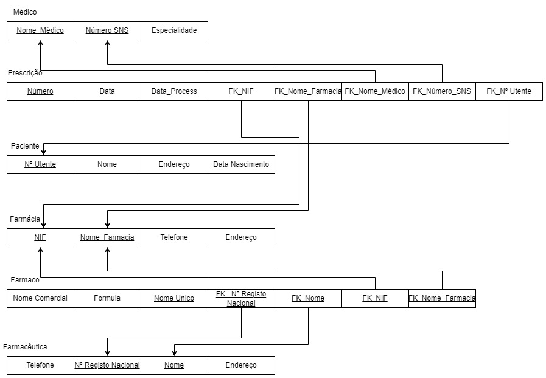
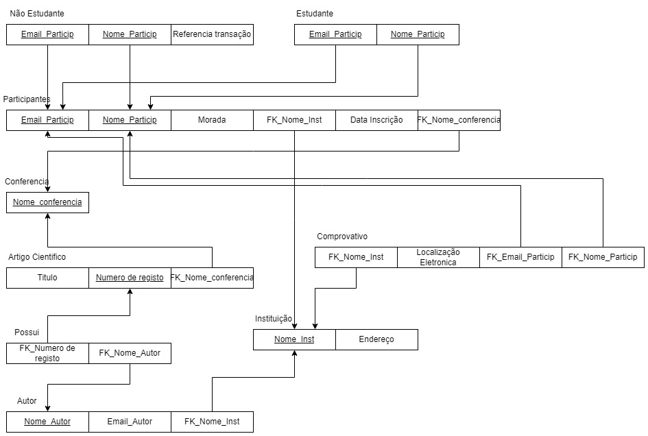
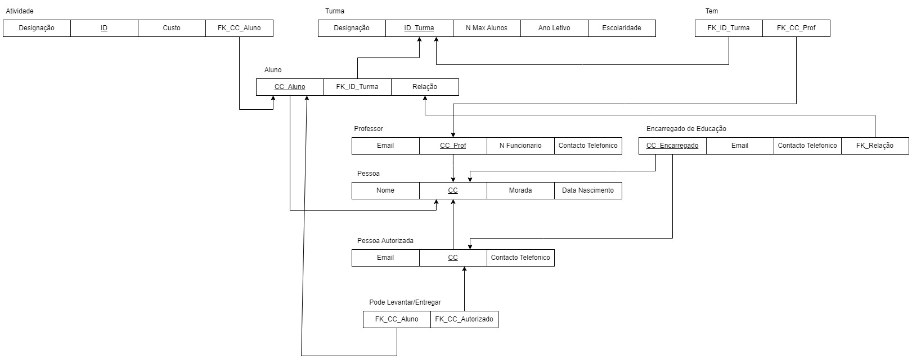

# BD: Guião 3


## ​Problema 3.1
 
### *a)*

```
ALUGER(numero: integer, duracao: integer, data: integer, FK_NIF: integer, FK_numero: integer, FK_matricula: string)

CLIENTE(NIF: integer, nome: string, endereco: string, num_carta: integer)

BALCAO(numero: integer, nome: string, endereco: string)

VEICULO(matricula: string, ano: integer, marca: string, FK_codigo: integer)

TIPO_VEICULO(codigo: integer, arcondicionado: boolean)

SIMILARIDADE(FK_codigo1: integer, FK_codigo2: integer)

LIGEIRO(codigo: integer, peso: double, passageiros: integer)

PESADO(codigo: integer, combustivel: String, portas: integer, numlugares: integer)
```


### *b)* 

```
Chave candidatas:
Aluger : número, FK_NIF, FK_número, FK_matricula
Cliente : NIF, num_carta
Balcao : número
Veículo : maticrula, FK_codigo
Tipo_Veiculo : código
Similaridade : FK_codigo1, FK_codigo2
Ligeiro : código
Pesado :  código

Chaves Primárias:
Aluger : número
Cliente : NIF
Balcao : número
Veículo : matricula
Tipo_Veiculo : codigo
Similaridade : FK_codigo1 + FK_codigo2
Ligeiro : código
Pesado :  código

Chaves Estrangeiras:
Aluger : FK_NIF (Cliente), FK_número (Balcao), FK_matricula (Veículo)
Veículo : FK_codigo (Tipo_Veiculo)
Similaridade : FK_codigo1 (Tipo_Veiculo), FK_codigo2 (Tipo_Veiculo)
```


### *c)* 




## ​Problema 3.2

### *a)*

```
AIRPORT(airport_code: String, city: String, State: string, Name: string)
AIRPLANE_TYPE(type_name: String, max_seats: int, company: String)
AIRPLANE(airpline_id: String, total_no_of_seats: integer, FK_type_name: String)
CAN_LAND(FK_type_name: String, FK_airport_code: String)
FLIGHT(number: integer, airline: String, weekdays: String)
FARE(FK_number: integer, Dependent_code: integer, amount: integer, Restrictions: String)
FLIGHT_LEG(FK_number: integer, Dependent_leg_no: integer, FK_arr_airport_code: String, FK_dep_airport_code: String, schedule_dep_time: integer, schedule_arr_time: integer)
LEG_INSTANCE(FK_number: integer, FK_dependent_leg_no: integer, dependent_date: integer, no_of_avail_seats: integer, FK_airplane_id: String, FK_arr_airport_code: String, FK_dep_airport_code: String, dep_time: integer, arr_time: integer)
SEAT(FK_number: integer, FK_dependent_leg_no: integer, FK_dependent_date: integer, dependent_seat_no: integer, Cphone: integer, customer_name: String)
```


### *b)* 

```
Chave candidatas:
Airport : Airport_code
Airplane_Type : Type_Name
Airplane: Airplane_id
Can_Land: FK_Type_name, FK_Airport_code
Flight: Number
Fare: FK_Number, Dependent_code
Flight_Leg: FK_Number, Dependent_Leg_no
Leg_Instance: FK_Number, FK_Dependent_Leg_No, Dependent_Date
Seat: FK_Number, FK_Dependent_Leg_no, FK_Dependent_Date, Dependent_Seat_no, Cphone

Chave primárias:
Airport : Airport_code
Airplane_Type : Type_Name
Airplane : Airplane_id
Can_Land : FK_Type_name + FK_Airport_code
Flight : Number
Fare : FK_Number + Dependent_code
Flight_Leg : FK_Number + Dependent_Leg_no
Leg_Instance : FK_Number + FK_Dependent_Leg_No + Dependent_Date
Seat : FK_Number + FK_Dependent_Leg_no + FK_Dependent_Date + Dependent_Seat_no

Chave estrangeiras:
Airplane : FK_Type_name
Can_Land : FK_Type_name, FK_Airport_code
Fare : FK_Number
Flight_Leg : FK_Number, FK_Arr_Airport_Code, FK_Dep_Airport_Code
Leg_Instance : FK_Number, FK_Dependent_Leg_no, FK_Airplane_id, FK_Arr_Airport_Code, FK_Dep_Airport_Code
Seat : FK_Number, FK_Dependent_Leg_no, FK_Dependent_Date
```


### *c)* 




## ​Problema 3.3


### *a)* 2.1



### *b)* 2.2



### *c)* 2.3



### *d)* 2.4

